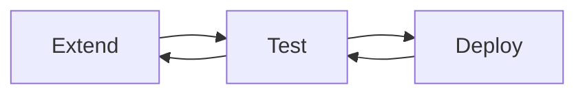
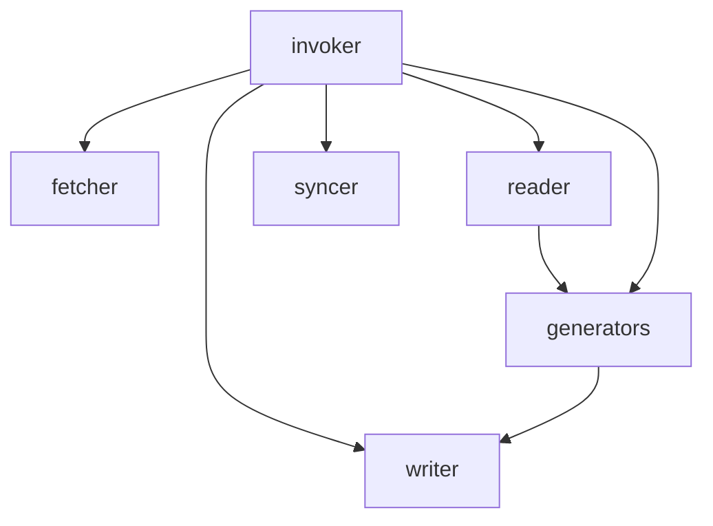

# Nimbella OpenAPI Plugin

This package is a plugin to extend the functionality of the Nimbella command interface, plugins allow developers to extend the functionality by adding commands or features.

## Prerequisites

This is an extension to the [Nimbella Command Line Tool](https://github.com/nimbella/nimbella-cli), ensure you have [it](https://nimbella.io/downloads/nim/nim.html#install-nim-globally)

```
nim -v
nimbella-cli/1.6.0 linux-x64 node-v14.4.0

```

## Install

Use this command to install the latest version of OpenAPI plugin

```
nim plugins add openapi
```

## Verify

Check the list of currently installed plugins:

```
nim plugins
openapi-1.0.0
```

---

> Now you are one command away from generating a full blown Serverless Nimbella Project and two commands away from taking your APIs out in the world.

Making the most out of your OpenAPI Collection, this command traverses through each endpoint, generates mocks, and unit tests.

Use below command and check your output directory for the resulting Nimbella Project.

```
nim project create -s openapi -o bhageena -i CloudKV.ioAPI  -k <swaggerhub-key> -l php -c
```
Alternatively, for a guided prompt, you can also do a 

```
nim project create -s openapi
```

Here `nim project create` project does exactly what it promises to be doing.

The `-i` stands for identity, it could be Spec Name or even a file on your disk, provided it's a valid OpenAPI Spec.

The `-k` expects a OpenAPI key, but it's optional, if you are providing a spec file via `-i`.

> If you want the spec to be pulled from the swaggerhub and do not have an API Key, you can easily generate one by heading over to the [SwaggerHub Settings API Keys](https://app.swaggerhub.com/settings/apiKey)

The `-l` is for language and it also is optional. It defaults to `nodejs`, but can be given any language from below the supported languages table.

Optionally, specifying `-c` flag will generate client code in language of your choice to call and test the newly created APIs. You can also choose other than default variants for your client code from below table. It can be passed in via `-l` value following a `:` e.g. `-i php:pecl_http`

### Supported Languages

| Language | Available Variants             | Default Variant |
| -------- | ------------------------------ | --------------- |
| Go       | Native                         | Native          |
| Java     | OkHttp, Unirest                | OkHttp          |
| NodeJs   | Native, Request, Unirest       | Request         |
| PHP      | cURL, HTTP_Request2, pecl_http | cURL            |
| Python   | http.client, Requests          | http.client     |
| Swift    | URLSession                     | URLSession      |

There are few more gears in the box, but you probably don't need all of them initially.
Below table covers full usage options:

## Usage Options

Options:

| Name               | Alias  | Description                                           | Type    | Required | Choices                                | Default |
| ------------------ | ------ | ----------------------------------------------------- | ------- | -------- | -------------------------------------- | ------- |
| **--help**         |        | Show help                                             | boolean |          |                                        |
| **--version**      |        | Show version number                                   | boolean |          |                                        |
| **--source**       | **-s** | Source Name                                           | string  | required | OpenAPI, SwaggerHub, Stoplight, Apiary | OpenAPI |
| **--id**           | **-i** | Document/Spec Id/Name/Path                            | string  | required |                                        |
| **--owner**        | **-o** | Owner User Name                                       | string  |          |                                        |         |
| **--key**          | **-k** | Key to access the Providers API                       | string  |          |                                        |         |
| **--language**     | **-l** | Target Language                                       | string  |          | go, nodejs, python, java, swift, php   | nodejs  |
| **--overwrite**    | **-o** | Overwrites the existing project directory if it exits | boolean |          |                                        | false   |
| **--updateSource** | **-u** | Sync updated document back to the Source App          | boolean |          |                                        | false   |
| **--clientCode**   | **-c** | Generates Client Code to test the deployed actions    | boolean |          |                                        | true    |
| **--update**       |        | Updates an existing project from new version of spec  | boolean |          |                                        | false   |

> Despite all the options available, you only need a Spec (`-i`) or maybe a key (`-k`).

Lo and behold, you have your serverless project created! You can open up your favorite IDE and browse through created code base. The size of the project obviously depends on the size of your spec.

Time to deploy? back to the command prompt again.
cd into the project folder and do a

```
nim project deploy .
```

Congratulations! your APIs are live now.

Verify the list of actions

```
nim action list
```

That's it! Easy isn't it?

You are into the groove now!

Extend -> Test -> Deploy -> Test -> Extend



> While you do your iteration with ease and needless to say, peace of mind comes bundled with serverless. This plugin also keeps your spec and project in sync. Be it the spec in SwaggerHub Cloud or spec in your file system. Things are in perfect harmony with your work in project or vice versa.

## Remove

```
nim plugins uninstall openapi
```

## Update

Plugins will auto update alongside the CLI, but to trigger an update directly run:

```
nim update
```

## Uninstall

Use this command to uninstall this plugin

```
nim plugin remove openapi
```

---

## Source Structure



- fetcher - they get data from apis
- syncer - they post updated data back to the apis
- reader - they read data fetched by fetcher or from file system, parse them and try to make sense out of that
- writer - they write documents using text generated by the generators, to the documents on file system
- generators - they generate sensible text/code from data given by readers
- invoker - they talk to the generators, fetcher, syncer, reader and writer, essentially they are controllers controlling all other participants
