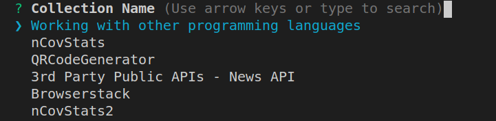
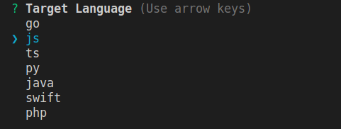
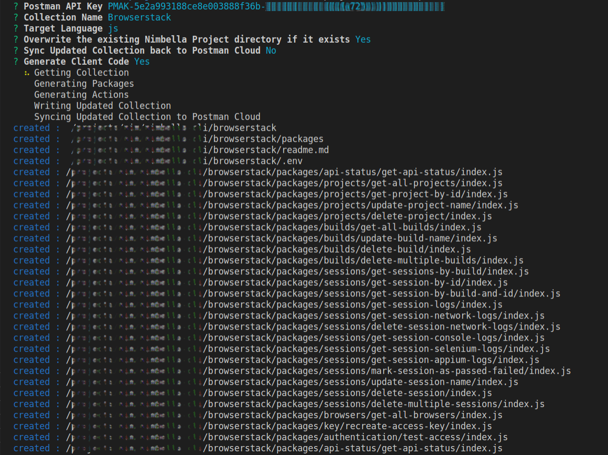
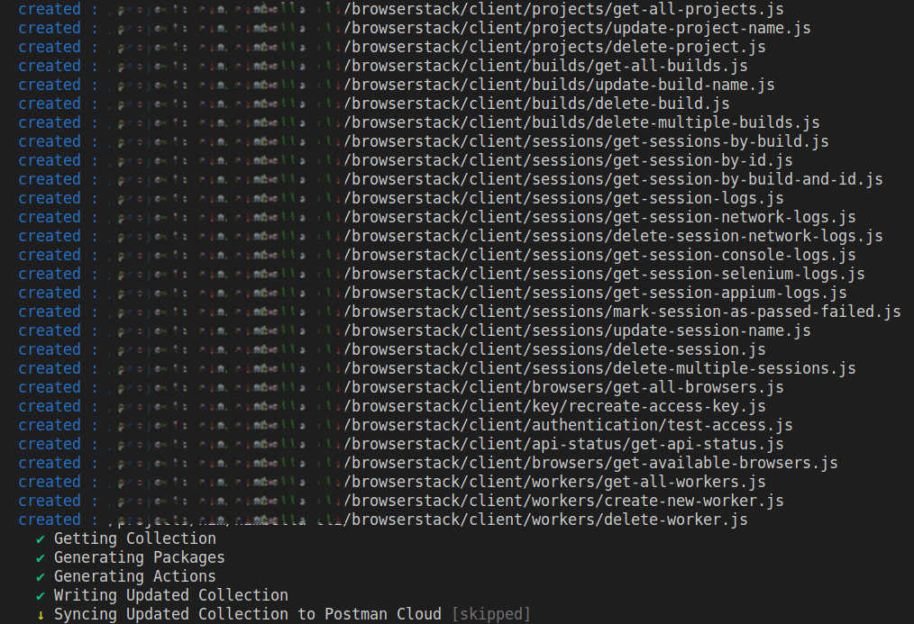
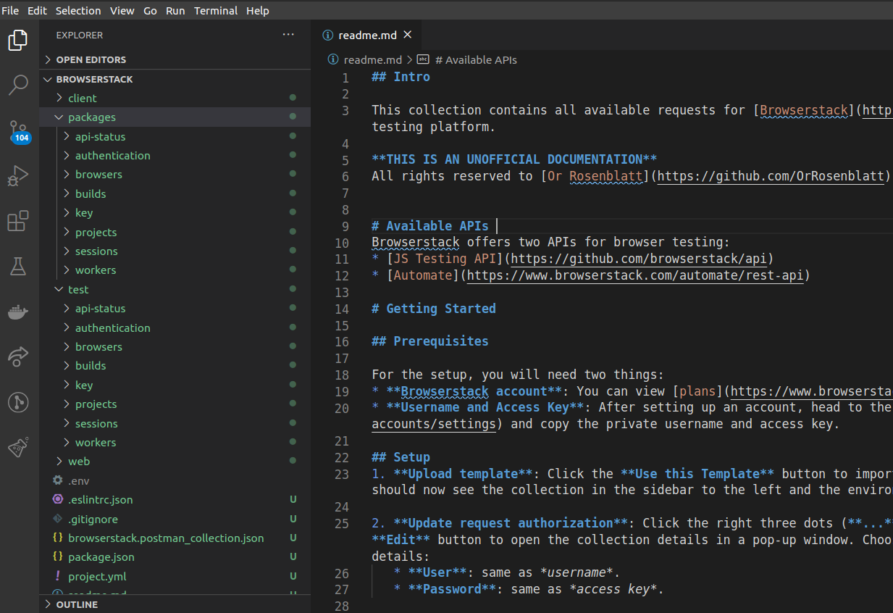
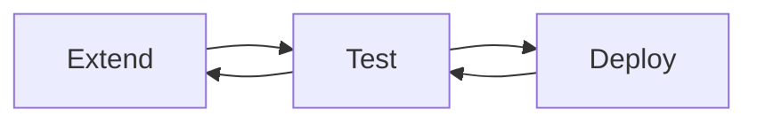
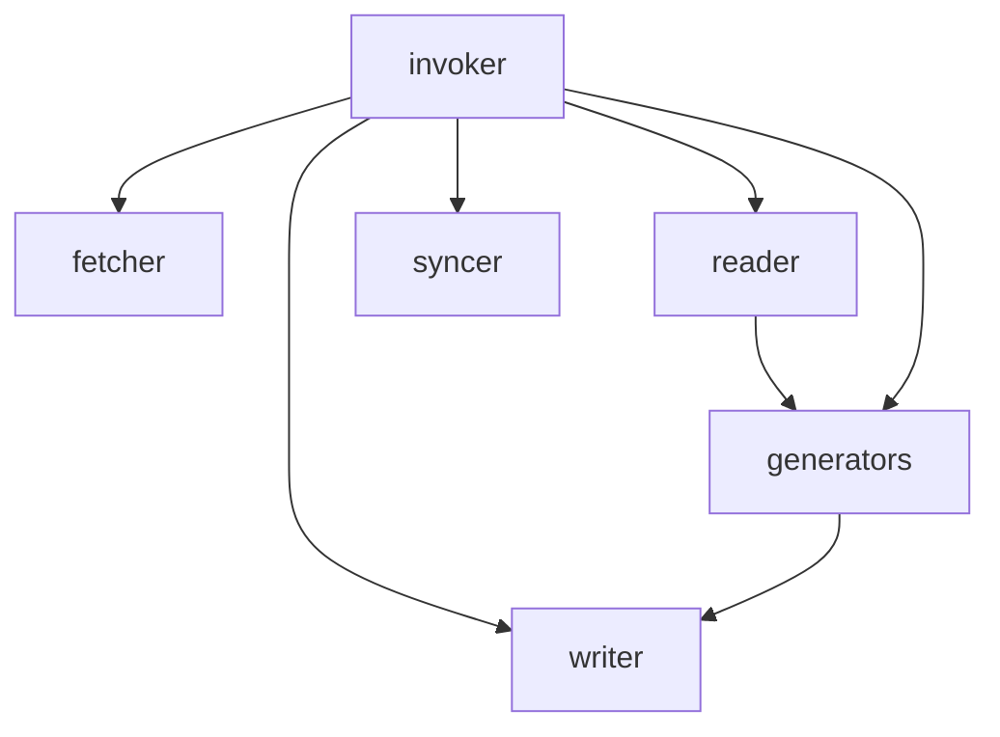

# Nimbella Postman Plugin

This package is a plugin to extend the functionality of the Nimbella command interface, plugins allow developers to extend the functionality by adding commands or features. 

If you write RESTful APIs, [Postman](https://www.postman.com/) is an indispensable tool. With over 4 million users, it has become a tool of choice for developing, testing, collaborating, documenting and maintaining the RESTful APIs. 

If you create/maintain Postman collections, with this plugin, getting a taste of serverless was never easier. Nimbella Postman Plugin is aimed for Postman users like you, it enables you to take your APIs into serverless world seamlessly with automated code stub generation and one command deployment. Along with code stub, generated project structure also contains Unit Tests, Postman Tests (updated in the collection document), Client Code and Nimbella Project Configuration File.

The collection document can also be synced to Postman Cloud by specifying a flag `on` at the time of plugin command invocation and thus the updated collection becomes ready for other collaborators instantly. 

This Nimbella CLI Plugin also works in off-line mode. i.e. if you have a copy of collection document on your disk, it can generate the project structure using the document. You can even use old collections. This plugin converts version `1.0` collection into version `2.0` and also saves it in the generated project directory.


## Prerequisites

This is an extension to the [Nimbella Command Line Tool](https://github.com/nimbella/nimbella-cli), [follow the steps](https://nimbella.io/downloads/nim/nim.html#install-nim-globally), if you haven't installed it already.


Use below command to check if Nimbella Command Line Tool (nim) is installed:
```
nim -v

nimbella-cli/1.6.0 linux-x64 node-v14.4.0

```

## Add the Postman Plugin

Use this command to add the latest version of Postman plugin

```
nim plugins add postman
```

## Verify

Check the list of currently installed plugins:

```
nim plugins

@nimbella/plugin-postman 0.0.0

```


## Create Project

Use below command to invoke the plugin into action: 

```
nim project create -s postman
```
It will present a guided prompt, with below steps

```
? Postman API Key  
```
Enter the key as given e.g. `PMAK-5e2a993188ce8e003888f36b-xxxxxxxxxxxxxxxxxxxxxxxxxxxxxxxxxx`. You can easily generate one by visiting the [Postman Integrations Dashboard](https://go.postman.co/integrations/services/pm_pro_api)

```
? Collection Name
```
You will have all the collections listed on your prompt, select one, you want to work with.



```
? Target Language
```
Select the language for project structure generation. Default is `js`, press enter to move ahead with that.



```
? Overwrite the existing Nimbella Project directory if it exists (Y/n) 
```
The project generated by this plugin has same name as the Postman collection, if you already have a folder with same name in your current working directory, it'll be overwritten. If you are running this command for the first time most likely you won't have a folder with same name, you can proceed ahead otherwise type `n` to stop.

> To update an existing project do a `nim project update -s postman`

```
? Sync Updated Collection back to Postman Cloud (y/N) 
```
Defaults to `No`. Typing `y` will sync updated Postman collection with new api endpoints and postman tests to Postman cloud. 

> The updated collection is saved in the generated project folder, irrespective of the selected option here. You can import it in to Postman App can continue working.    

```
Generate Client Code (Y/n) 
```
Defaults to `yes` and generates client code in the selected language.


You will see the project structure getting created and prompt will print the list of files created.



Upon successful completion, the prompt will display the list of action completed or skipped as directed.



Open your favorite IDE and navigate through the code stub, run unit tests, tweak, extend etc.



When you feel it should go live, Nim CLI with one command deployment is ready for it. `cd` into the project directory and run

```
nim project deploy .
```

## `one-line` Mode 

> Alternatively, you need only two commands to take Postman collection APIs to serverless Urls. You can generate a full blown Serverless Project in one command and take your APIs out in the world with the other.


At times you feel too impatient to navigate through questions and confirmations of the guided prompt or you want to use this tool in your automation pipeline, you can specify the args using `one-line` syntax and yet achieve the same results.

```
nim project create -s postman -i CloudKV.ioAPI  -k <postman-key> -l php -c
```

Making the most out of your Postman Collection, this command traverses through each endpoint, generates mocks, unit tests and postman tests, merging well with tests that are in the collection already.

Deploy the project using

```
nim project deploy .
```

## `one-line` Command Options and Their Intent

Options:

| Name               | Alias  | Description                                                 | Type    | Required | Choices                                | Default |
| ------------------ | ------ | ----------------------------------------------------------- | ------- | -------- | -------------------------------------- | ------- |
| **--help**         |        | Show help                                                   | boolean |          |                                        |
| **--version**      |        | Show version number                                         | boolean |          |                                        |
| **--source**       | **-s** | Source Name                                                 | string  | required | Postman, SwaggerHub, Stoplight, Apiary | Postman |
| **--id**           | **-i** | Document/Collection Id/Name/Path                            | string  | required |                                        |
| **--key**          | **-k** | Key to access the Providers API                             | string  |          |                                        |         |
| **--language**     | **-l** | Target Language                                             | string  |          | go, nodejs, python, java, swift, php   | nodejs  |
| **--overwrite**    | **-o** | Deletes the existing nimbella project directory if it exits | boolean |          |                                        | false   |
| **--updateSource** | **-u** | Sync updated document back to the Source App                | boolean |          |                                        | false   |
| **--clientCode**   | **-c** | Generates Client Code to test the deployed actions          | boolean |          |                                        | true    |
| **--update**   |  | Updates an existing project from new version of postman collection          | boolean |          |                                        | false    |


The `-i` stands for identity, it could be Collection Id, Name or even a file on your disk, provided it's a valid postman collection.

The `-k` expects a postman key, but it's optional, if you are providing a collection file via `-i`.

> If you want the collection to be pulled from the Postman cloud and do not have an API Key, you can easily generate one by heading over to the [Postman Integrations Dashboard](https://go.postman.co/integrations/services/pm_pro_api)

The `-l` is for language and it also is optional. It defaults to `nodejs`, but can be given any language from below the supported languages table.

Optionally, specifying `-c` flag will generate client code in language of your choice to call and test the newly created APIs. You can also choose other than default variants for your client code from below table. It can be passed in via `-l` value following a `:` e.g. `-i php:pecl_http`

## Supported Languages

| Language | Available Variants             | Default Variant |
| -------- | ------------------------------ | --------------- |
| Go       | Native                         | Native          |
| Java     | OkHttp, Unirest                | OkHttp          |
| NodeJs   | Native, Request, Unirest       | Request         |
| PHP      | cURL, HTTP_Request2, pecl_http | cURL            |
| Python   | http.client, Requests          | http.client     |
| Swift    | URLSession                     | URLSession      |


## Manage, Monitor the APIs with Nim CLI

Check list of APIs
```
nim action list
```

Check invocation list
```
nim activation list
```

Check logs of a particular invocation
```
nim activation get <activation id>
```

Further commands are listed [here](https://nimbella.io/downloads/nim/nim.html)

## Update Project

In collaborative environments, chances are that a Postman collections gets updated or extended multiple times. The project structure 
generated through `nim project create -s postman` can be synchronized using 

```
nim project update -s postman
```

To keep up with the ever changing world, you can iterate through the cycle many times.

Extend -> Test -> Deploy -> Test -> Extend



> While you do your iterations with ease of serverless. This plugin also keeps your collection and the serverless project in sync. Be it the collection in Postman Cloud, Postman App or Collection in your file system. Things are in perfect harmony with your work in project to collection document or vice versa.

## Uninstall

Use this command to uninstall this plugin

```
nim plugin remove postman
```

## Update

Plugins will auto update alongside the CLI, but to trigger an update directly run

```
nim update
```

---

## Source Structure


The whole source code structure is broadly categorized as follows:

- fetcher - they get data from apis
- syncer - they post updated data back to the apis
- reader - they read data fetched by fetcher or from file system, parse them and try to make sense out of that
- writer - they write documents using text generated by the generators, to the documents on file system
- generators - they generate sensible text/code from data given by readers
- invoker - they talk to the generators, fetcher, syncer, reader and writer, essentially they are controllers controlling all other participants

--------------